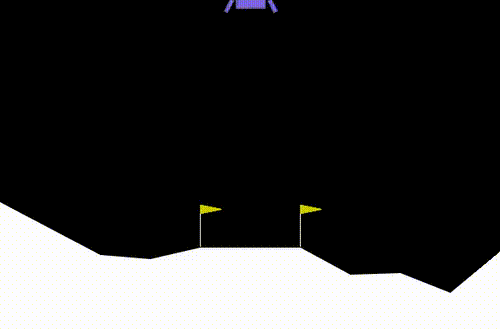
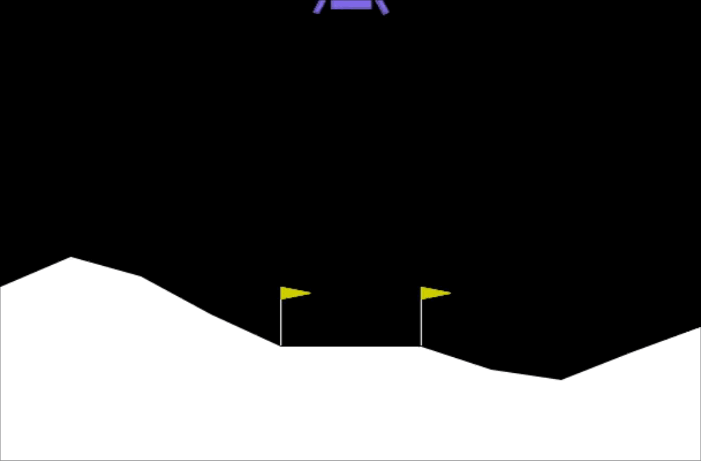

# Landing on the Moon with Reinforcement Learning

<table>
  <tr>
    <!-- First Image -->
    <td>
      
       
      
<strong>Failed Lunar Lander</strong>

    </td>
    <!-- Second Image -->
    <td>
      
       
      
<strong>Passed Lunar Lander</strong>

    </td>
  </tr>
</table>

# Rules
The OpenAI Gym environment provides LunarLander environment, which is simply a task or problem we want to solve. We will solve Lunar Lander by Reinforcement Learning.
- The two flag poles surround the center 0,0 of the landing pad
- Lander is allowed to land outside landing pad
- Lander starts at the top center of the environment
- Fuel is cheap (infinite)
- Need 200 points to win

### The Agent
The agent is the entity that learns from interactions with the environment. It makes decisions based on the state of the environment, attempting to achieve a goal. In the case of the Lunar Lander:

**Goal**: Safely land the lunar lander on the landing pad.

**Decision-making**: The agent decides at each time step which action to take from the set of available actions (do nothing, fire right engine, fire main engine, fire left engine).

### The Environment
The environment encompasses everything external to the agent that the agent interacts with. This includes the lunar lander's dynamics, the moon's surface, the landing pad, and the laws of physics that govern how actions affect the state of the lander. In RL, the environment is responsible for:
- Providing state information to the agent: at each time step, the environment supplies the agent with the current state, which includes the lander’s position, velocity, angle, angular velocity, and whether each leg is touching the ground.
- Responding to the agent's actions: After an action is taken by the agent, the environment transitions to a new state and provides feedback in the form of a reward signal.

### Interaction Process
- Observation Space: The state vector provided by the environment to the agent. For the Lunar Lander, this includes spatial coordinates, velocities, and contact points.
- Action Space: The set of all possible actions the agent can take. In this environment, these actions control the lander’s engines.
- Rewards: Positive and negative feedback provided to guide the agent's learning. Rewards in the Lunar Lander are based on proximity to the target, movement speed, orientation, and successful landing or penalties for crashing.
- Episode Termination: Conditions under which the current episode (or trial) ends. This could be when the lander lands or crashes, or when it moves out of the designated horizontal boundaries.

### Learning and Optimization
The agent learns an optimal policy — mapping `states` to `actions` — through repeated interaction with the environment, guided by the reward signals. The agent aims to maximize the cumulative reward over time, which, in this scenario, would mean learning how to land the lander safely and efficiently. Various RL algorithms can be employed to learn this policy, such as Q-learning, deep Q-networks (DQN), or policy gradient methods, depending on the specific requirements and characteristics of the problem and the available data.

<figure>
  <image src = "images/rl_formalism.png" width = 100%>
</figure>
Above shows agent-environment loop. Here:
<ul>
<li> Agent interacts with environment in discrete steps t=0,1,2,3...
<li> Each step t, agent uses policy π to select action A_t based on current state S_t
<li> Agent receives reward R_t
<li> Next time step is the new state S_(t+1)

# Deep Q Learning
When both the state and action space are discrete we can estimate the action-value function iteratively by using the Bellman equation:

$$ Q(s,a) = R(s) + \gamma \max_{a'}Q(s',a') $$

Here, \( Q(s,a) \) is the return if you start in state \( s \), take action \( a \), then behave optimally after that. \( \pi(s) = a \) where \( a \) is chosen. This only works if you can compute \( Q(s,a) \) for every action. Note that \( s' \) means the new state we got to after taking action \( a \). The prime represents a new action or new state.

The above Bellman equation is similar to $$ f_{w,b}(x) \approx y $$ Getting the actual \( (x,y) \) points is simple. We do random actions and get various states. Based on these states, we determine \( x \) as the (state, action) tuple, and \( y \) as the right hand side of the Bellman equation, as determined by \( R(s) \) and \( S \), both of which are given.

Above, we see that \( y \) is determined by \( R(s) + \gamma \times \max_{a'} Q(s',a') \). Now, how do we know what the maximum of \( Q \) is? We need to calculate \( Q \) for all possible actions in state \( s' \) to get the maximum. Since \( Q \) is recursive, initially we don't know what the \( Q \) function is. So at every step, \( Q \) here is some guess.

Once we have the above data, we train a Neural Network to try to predict \( y \) as a function of the input \( x \).

The iterative method converges to the optimal action-value function \( Q^*(s,a) \) as \( i \) approaches infinity.

So the agent gradually explores the state-action space and updates the estimate of the action-value function \( Q \) until it converges to the optimal action-value function.

